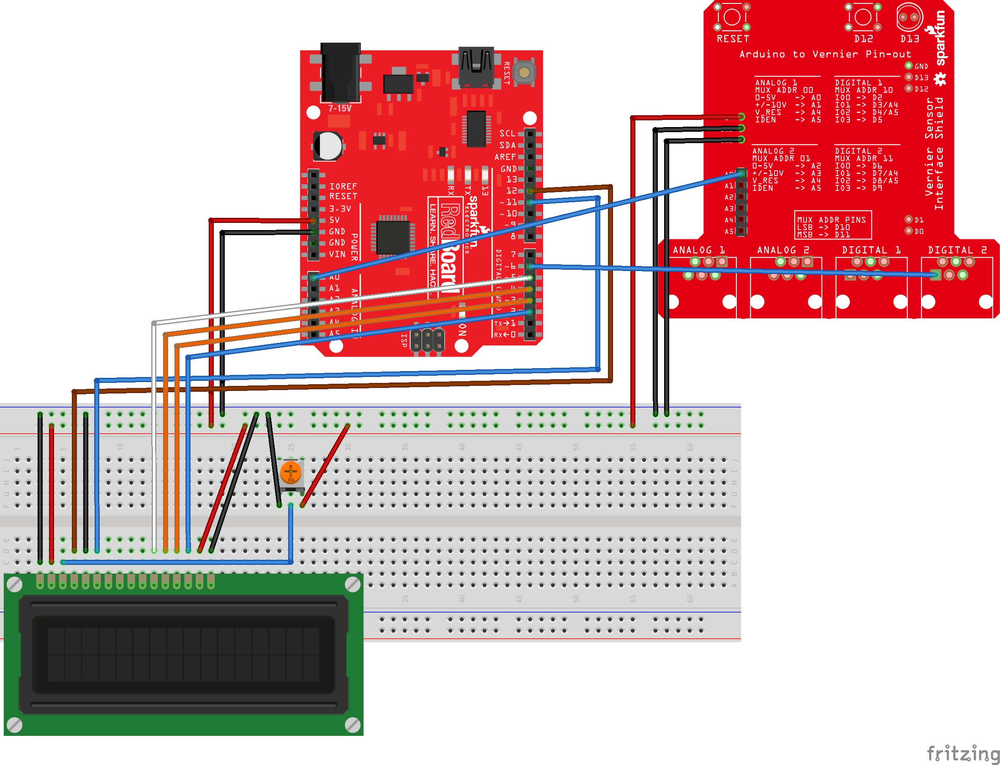

# The Titration Machine

## Automating titrations with the help of an Arduino.

Created by Nick DeGroot and Trevor Li.

## Libraries Used

- LiquidCrystal.h (comes standard)
- [Vernier](https://github.com/VernierSoftwareTechnology/VernierLib)

## Wiring

